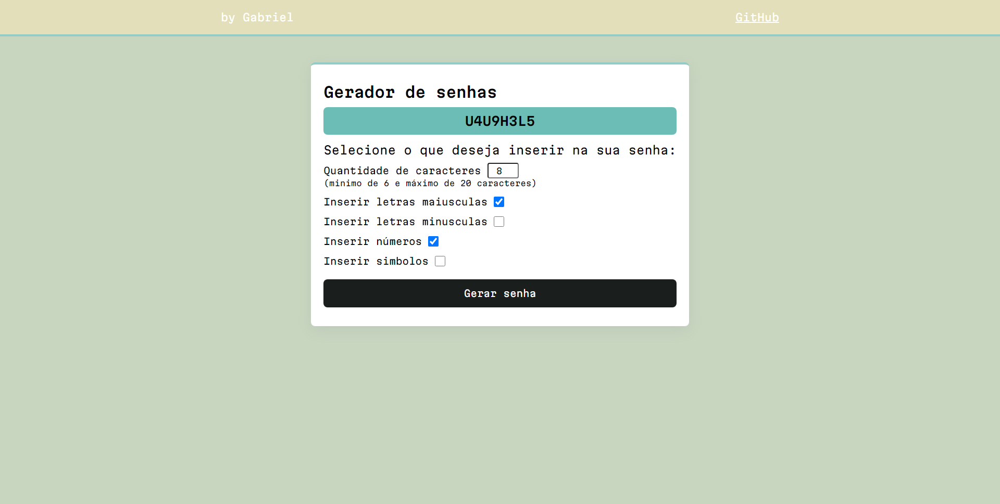

# Gerador de senhas

Projeto construído utilizando:

- HTML
- CSS
- Javascript

## Overview

Projeto simples para treinar minhas skills em Js, neste projeto é possivel criar uma senha que tenha no minimo 6 e no maximo 20 caracteres, selecionar se deseja que seja inserido na senha:

- letras maiusculas
- letras minusculas
- numeros
- simbolos

### Screenshot

#### Autor

Linkedin - 

Frontend Mentor -  
